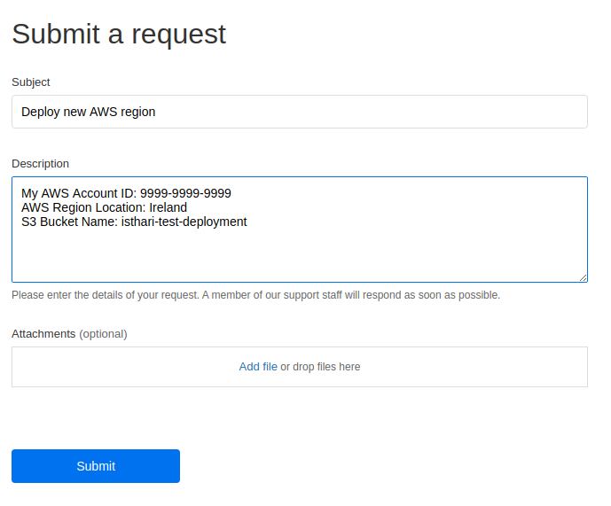


This is a step by step guide to deploy a "Region" in your AWS cloud account in the fully managed mode. The Isthari support team will take care of the installation, upgrades and support

**BEWARE:** You're granting Isthari full administration rights in your AWS account.

First, go to the [Cloud Formation page](https://console.aws.amazon.com/cloudformation/) in AWS console  

In the upper right corner, click on "Create Stack" and later in "With new resources (standard)"

 

Copy the url of the Cloud Formation template in the field Amazon S3 URL [https://isthari-templates.s3.amazonaws.com/isthari-remote-admin-template-v1.0.txt](https://isthari-templates.s3.amazonaws.com/isthari-remote-admin-template-v1.0.txt)

Then click on Next button

Introduce the value "IsthariRemoteAdmin" (without spaces) in the field Stack name and click on Next button

Scroll down to the bottom of the page and click on Next button

Scroll down to the bottom of the page and check the option "I acknowledge that AWS CloudFormation might create IAM resources with custom names."
Then click the Create stack button

AWS Cloud Formation will start the automatic configuration process. You can change the progress

After a few minutes you can refresh to check if the process has finished

After the process has finished you can [open a ticket](https://istharihelp.zendesk.com/hc/en-us/requests/new) with the support team to finish the configuration of your cloud region

Subject: Deploy new AWS region
Description:

My AWS Account ID: 9999-9999-9999
AWS Region Location: (North Virginia, North Carolina, Hong Kong, Mumbai, Sidney, Singapur, Tokio, Ireland, Bahrein)
S3 Bucket Name: The name of the bucket that you want to use for your data (It must not exists or if exists it must belong to your account)

Then click on Submit button

Once we've reviewed your request our support team will take upto 24 hours to fully configure your AWS Region, they usually process the ticket in less than 1 hour

