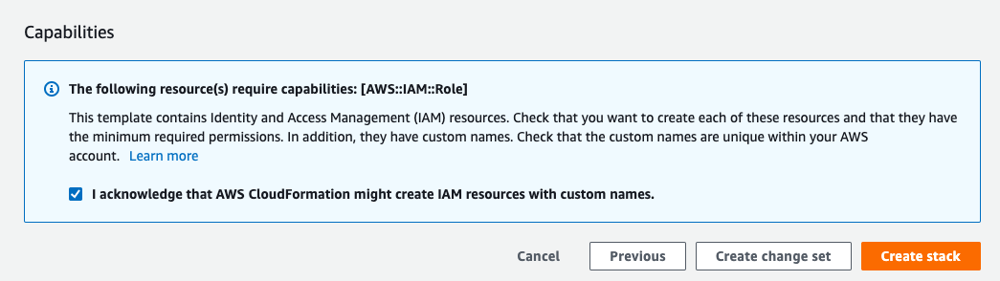


This is a step by step guide to deploy a "Region" in your AWS cloud account

First, go to the configuration section

Click on "Regions" submenu on the left side

 

Click on "CREATE NEW"

Select a descriptive name for your new region

Select the cloud provider "AWS"

Select the region to deploy the Isthari Big Data SaaS solution, for example N. Virginia

Indicates a new bucket name to store your initial data. This bucket MUST NOT exists, you can use the "Test" button to verify

And then click on "CREATE TEMPLATE"

The platform has just created an AWS Cloud Formation Template and is ready to start deploying your new regions, you just need to click on "Deploy Template"

Verify the IP addresses that will be used by your new VPC and click on "Next" button

On the "Configure stack options" screen click on Next button

In the last screen please check the option "I acknowledge that AWS CloudFormation might create IAM resources with custom names" and click "Create Stack"

Once started the process, you can check the status from the regions table

---

