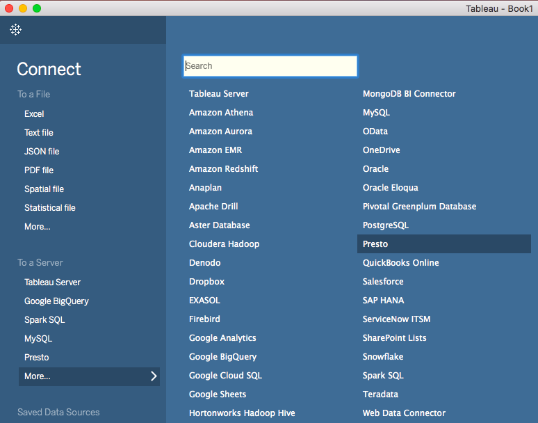


This article show you how to connect your existing Tableau to your cloud account

First you must download and install the Official Presto Tableau Driver [https://www.tableau.com/support/drivers](https://www.tableau.com/support/drivers)

Select Data Source: "Presto"

Choose your Operating System and Bit Version

Download and install your driver

Once installed open Tableau Desktop 

Select Presto data source type from the menu

Configure the server to connect to. It'll depend on the cloud provider and region of your account.

To get the server for your environment you must contact your Administrator

Port: 443

Contact your account administrator to get the Catalog of your Company

Select Authentication: LDAP

Introduce your username and password

Check Require SSL

Click Sign In

Now select the schema and table as usual with Tableau and start working !!!

---

