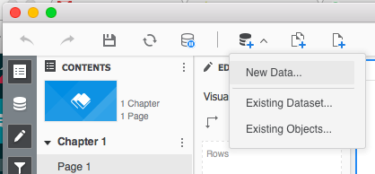
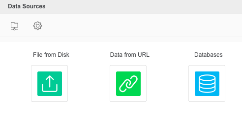
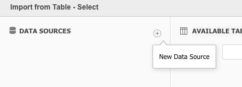
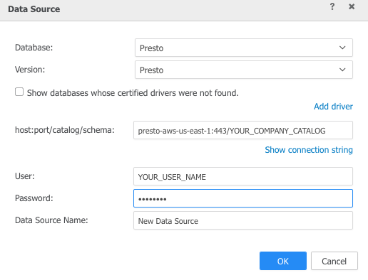
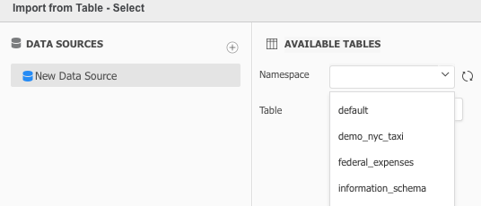


This article show you how to connect from your existing Microstrategy to your cloud account

You don't need to download or install any extra driver, because is already built-in

Select "New Data" from the toolbar

Then select databases

Check "Select tables" and click next

Click on "New Data Source"

Contact your account administrator to get the server for your environment

Contact your account administrator to get the Catalog of your Company

Introduce your username and password

And click Ok

Now select your datasource to see the available namespaces 

Now select the table

---

