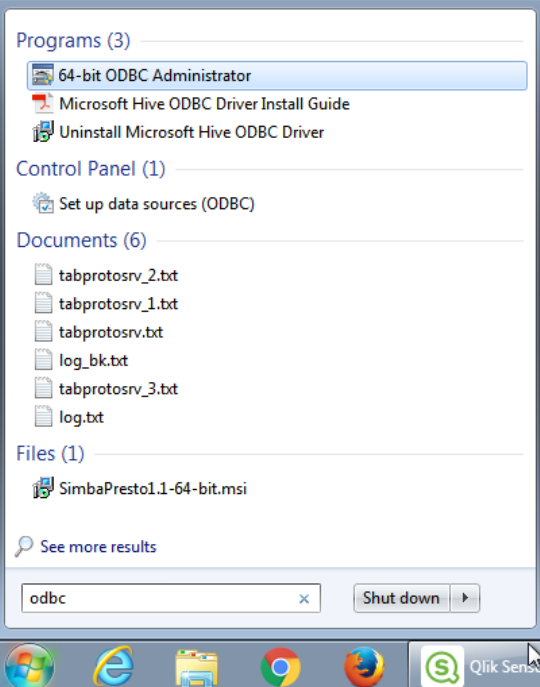
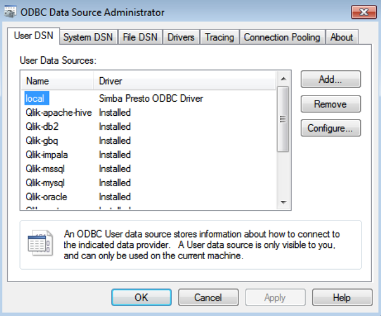
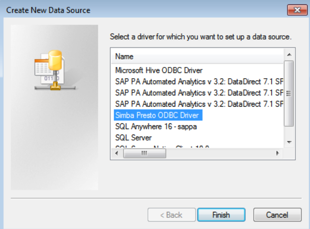
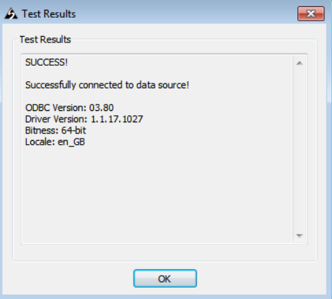
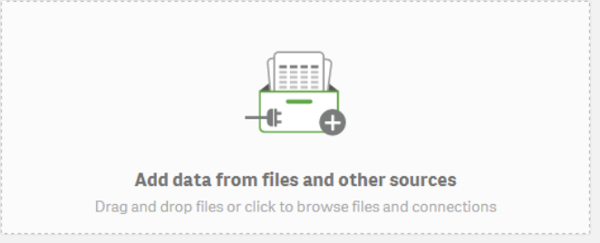
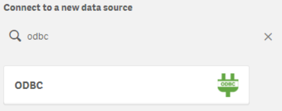
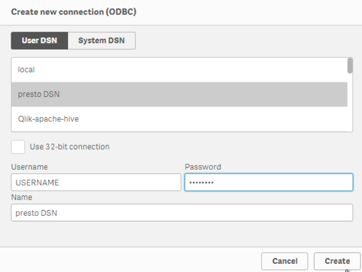


This article shows you how to connecto your existing QlikSense to your cloud account

First you must download and install the presto driver from Simba https://www.simba.com/drivers/presto-odbc-jdbc/

Then open the ODBC Administrator

Click on "Add" button

Select "Simba Presto ODBC Driver" and click Finish

Select Authentication type: "LDAP Authentication"

Introduce your user and password

Contact your account administrator to get the server for your environment

Port number 443

Click on "Test" button to check your connectivity

Now on QlikSense click on Add data from files and other sources

Search for ODBC Connector and click on it

In the User DSN select your new datasource and introduce your username and password, then click on create

Now you can continue working as usual with QlikSense

